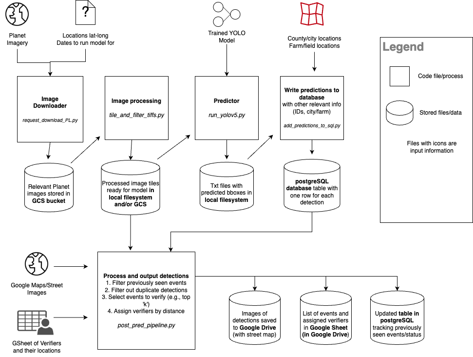

# Winter Spreading Detection Pipeline
This folder has the code for a pipeline that detects likely winter manure spreading events using satellite imagery and a trained/tuned [Yolov5](https://github.com/ultralytics/yolov5) object detection model. 

This pipeline was first set up and used during the winter 2022 field trial with Environmental Law and Policy Center (ELPC) and Wisconsin Department of Natural Resources (WDNR), where detections were sent out to staff from both these agencies for verification. For this pilot, [the best YOLOv5 model weights from the CIKM paper](https://www.dropbox.com/scl/fo/sjc3fafuz1m65u0trnx78/h?rlkey=me9bb7wjbpl80ngtl36yfx4oo&dl=0) were used. The training performance and analysis are detailed in the CIKM paper, see [this folder in the repo](../cikm/) for details. This pilot focused on 6km by 6km grids around known Concentrated Animal Feeding Operations (CAFOs), found in this file in the repo ```data/cafos_and_satellites_points_extra_door.csv```. The detections sent for verification, and the results of the verification are uploaded to [this Hugging Face repository](https://huggingface.co/datasets/reglab/land-app-trial).

It has since been slightly adapted for ELPC to continue running the pipeline in winter 2023, which is currently ongoing. The model was retrained to reduce its rate of false positive detections -- a high-level summary of this retraining procedure is [here](https://docs.google.com/document/d/1Z-dV0W7nWohtvUOkbTmlI0B7EXG3aC9pDdWjQAgAJV4/edit?usp=sharing).

## Overview of the pipeline
The key components are as follows:
- Linux server with Python, Git and other required packages installed to run the pipeline
- A subscription to [Planet](https://www.planet.com/) satellite imagery, which is the imagery source for the model
- [Google Cloud Storage bucket](https://cloud.google.com/storage) (GCS), for storing the downloaded satellite images
- postgreSQL database, for storing information about the model's detections and outputs
- Google Drive, for outputting the final selected model detections in Google Sheets and associated image in a format appropriate for field verifiers

The main input data/files for this pipeline are:
- A CSV file of lat-long locations of interest - the imagery will be downloaded for user-defined size grids around these locations (e.g., 5km by 5km). For the winter 2022 pilot, 
- Yolov5 model weights: weights of a trained Yolov5 model. F
- Shapefiles of cities/towns, as well as of fields/farms, to add additional contextual information for each model detection
- Google Sheet of field verifiers and their location info, to be able to filter detection events to those near the verifiers

The image below outlines how these components and inputs work together:



## Running the pipeline

### One-time setup
0. We assume that there is a project on Google Cloud Platform, a storage bucket in Google Cloud Storage, a subscription to [Planet](https://www.planet.com/) imagery, and a postgreSQL server set-up.
1. Clone this repository on the server/computer where you want to be running code. The instructions below assume a Linux/Ubuntu server. Navigate to this folder root (elpc_pipeline).
2. Set up a Python virtual environment: `python -m venv venv`
3. Activate the environment: `source venv/bin/activate`
4. Install GDAL:

```
sudo apt install libgdal20 libgdal-dev
pip install --global-option="build_ext" --global-option="-I/usr/include/gdal" gdal==$(gdal-config --version)
```

5. Install the other Python package requirements: `pip install -r requirements.txt`

6. Clone the yolov5 repository and install its dependencies:

```
git clone -b v7.0 https://github.com/ultralytics/yolov5.git
cd yolov5
pip install -r requirements.txt
cd ..
```

7. Authenticate/log into google cloud, by running `gcloud auth login`. The recommended authentication method is to create a [service account](https://cloud.google.com/iam/docs/service-account-overview), give it the right permissions (read/write from GCS bucket), download the credentials JSON file, and use this JSON file as an argument to `gcloud auth login`. Documentation is [here](https://cloud.google.com/sdk/gcloud/reference/auth/login). 

7. Create a `secrets.yaml` file at the root of the repository, in the same format as `example_secrets.yaml`. Fill in the database credentials, Planet API key (found in the user's web Planet dashboard), and a Google Maps API key (which can be created in the GCP project under the APIs tab).

8. Run the service account credentials JSON through the function below, and copy the output to the `gcs` parameter in the `secrets.yaml` file. Planet [requires the GCS credentials](https://developers.planet.com/apis/orders/delivery/#delivery-to-cloud-storage) to be fed in this format to allow downloading the images directly to the GCS bucket 

```cat api_service_agent_creds.json | base64 | tr -d '\n'```

9. Set up the database schema: `sql/launch_test_schema.sql` has the required schema and table format that should be run in SQL. You can change the name of the schema, but be sure to update the correct schema name in the pipeline config YAML file when running the pipeline.

### Regular running instructions
1. Update a config YAML file in the `configs` folder, checking that all the options/file paths are as desired. The existing complete config file (pipeline_config.yaml) has comments about what each parameter means, but the main ones to check are: (a) The locations CSV being inputted, (b) The dates for which imagery is downloaded, (c) `conf_thresh``, the model's score confidence threshold above which detections are kept, and (d) the method for selecting events to send to verifiers.

2. Navigate to the root `elpc_pipeline` folder and activate the environment: `source venv/bin/activate`

3. The main run command is then: 

```python3 run_pipeline.py --config_file {PATH TO CONFIG YAML} --secrets_file {PATH TO SECRETS YAML} --log_level {DESIRED LOG LEVEL: 10/20/30/40/50}```

The numeric values for log levels and their meaning are [here](https://docs.python.org/3/library/logging.html#levels). Running the command will start printing out some content, with a level of detail based on the log level set, and write the same information to a log file with a timestamped filename.

The code structure mirrors the pipeline diagram shown above, where each process is a module stored in `scripts`. The `run_pipeline.py` file is the main runner that stitches everything together, and runs the pipeline from end-to-end, including setting up logging and writing meta-info about runs to the database.

### Tips and notes
- The location ID that each detection is associated with, and that determines the file structure for how images are stored (e.g. loc_{id}/{date}), comes from the inputted locations CSV file's 'id' column. For ease of tracking, we would recommend ensuring that the same location maintains the same ID, even if changing the set of locations fed into the model.

- If an error or exception occurs, try lowering the logging level for more details and check the log files to see why the error occured. Some common errors include: 

    i. Packages not installed properly (check `pip list` to see a list of all packages installed in the environment)
    ii. Correct permissions not given to the service account

- Use the database to browse data and troubleshoot. In particular, the `pipeline_runs` table in the schema will allow you to quickly view relevant information about a pipeline run (e.g., run status, key parameters set in the config file, run timestamp), and connect this to the detections/outputs that the run created.

- One set of very important variables in the config are `use_yesterday` and `use_today`. Only one can be True but both may be False. If you use one, it will automatically update the date to the current day or the previous day.


